# 多元函数

## 定义

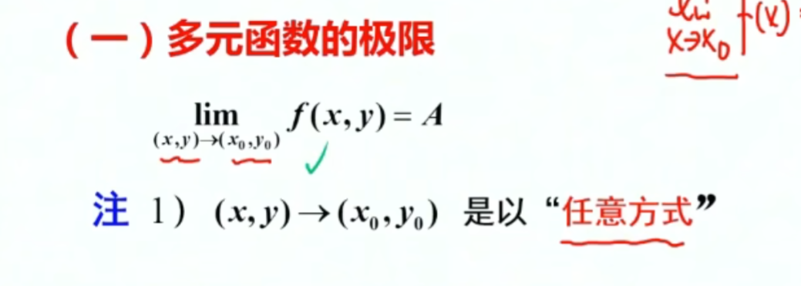

-   需要从任意方向趋向，否则极限不存在

## 性质

-   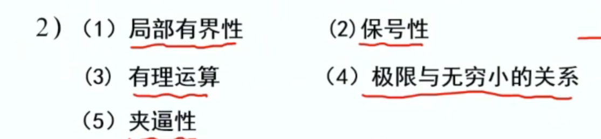
-   ==多元函数没有洛必达==

### 例

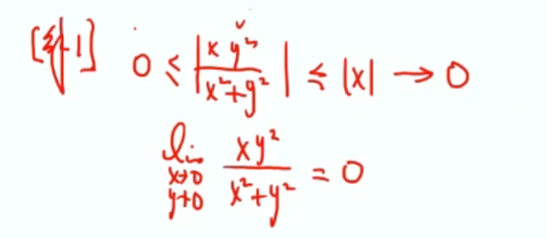

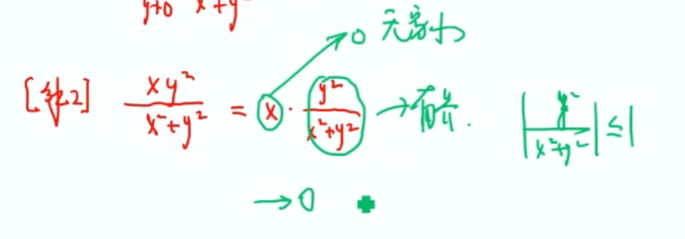

-   无穷小*有界*

 

### 结论

-   一般分子次数大于分母次数极限0
-   A = B -------- 不存在
-   A低于B  ------ 无穷

-   f（x）->0 == |f(x)| ->0

# 连续

-   极限 == 函数值

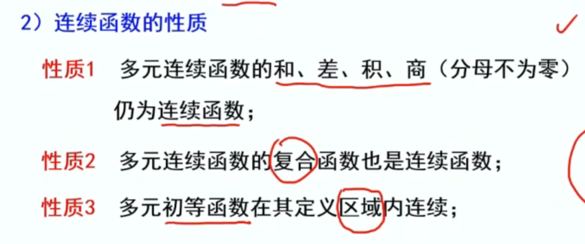

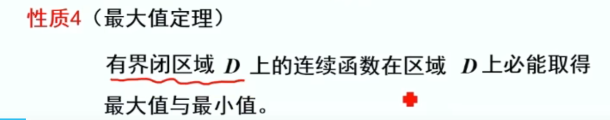

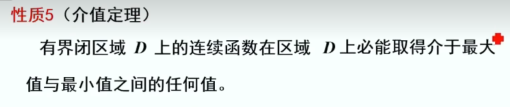

-   有界
-   

# 间断点

-   不好分

# 偏导数

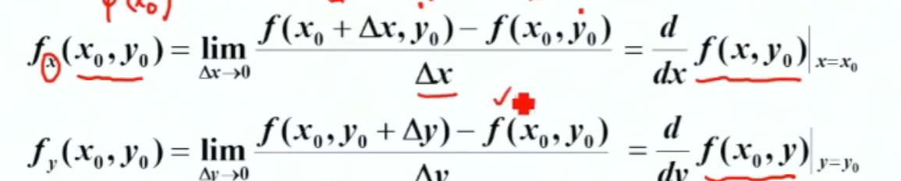

对x的偏导时，把y带入成y0，求偏导

### 例

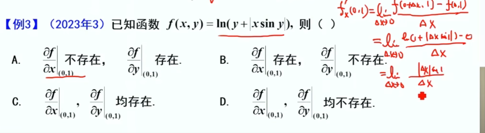

不存在，存在A

### 偏导数的几何意义

-   一张曲面的导数

对x的偏导就是带入y0，

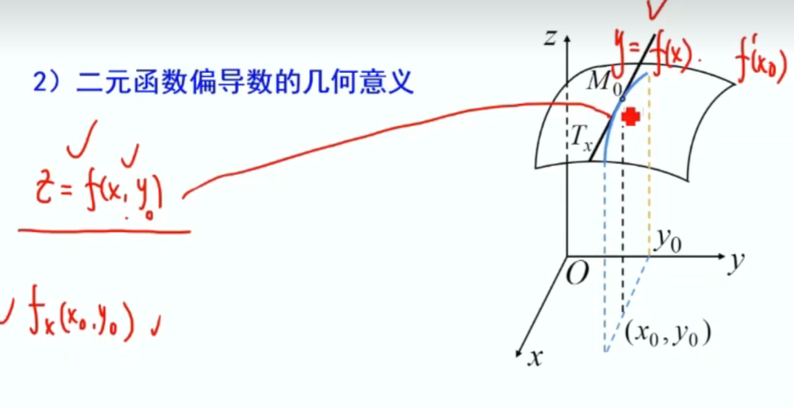

对x的偏导就是黑色的切线

## 高阶偏导数

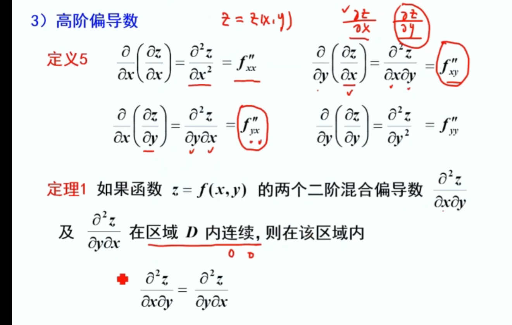

##  全微分

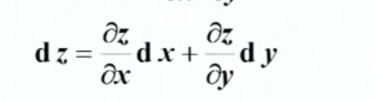

-   偏导数都存在（必要）
-   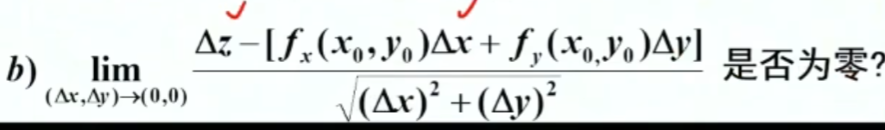

### 充分条件

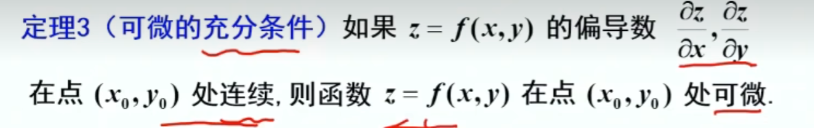

### 关系图

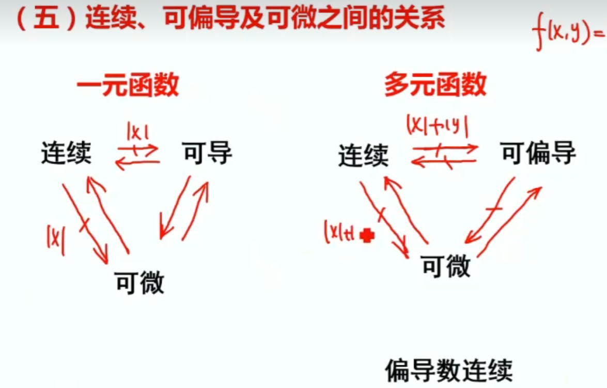