# 积分

-   连续函数有原函数

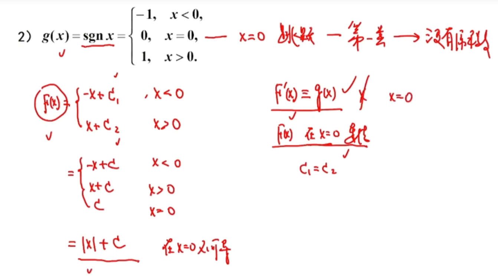

不可导所以不能是他的原函数

## 常见的凑微分

$$\frac{dx}{\sqrt{x}} = 2d\sqrt{x}$$

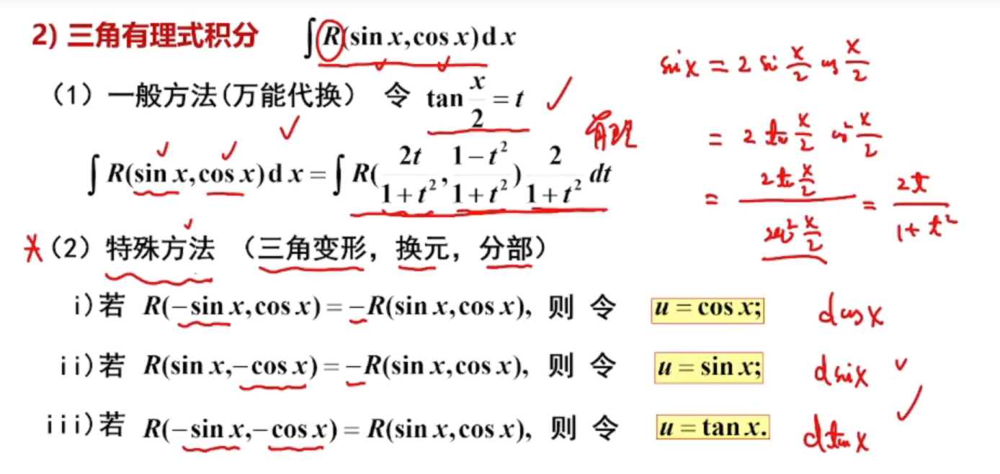

-   次数低万能代换好用

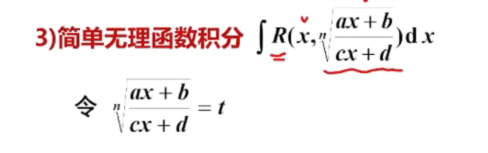

-   开几次但是必须内部是两个一次的比

# 定积分

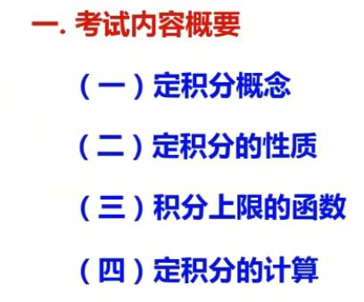

## 定积分的概念

-   分：在区间内分n-1个点
-   匀：f（x）*x
-   和
-   极限

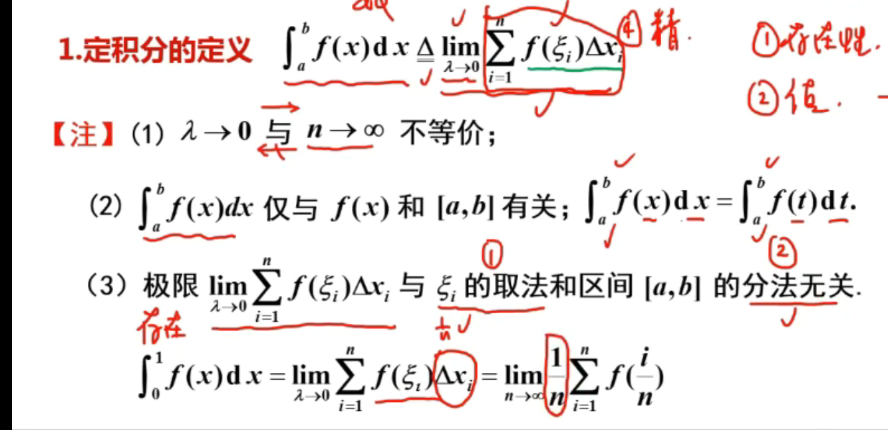

入：最大子区间的长度

## 定积分存在的充分条件

### 性质

-

-   积分中值定理

## 积分上限函数

-   上限是x则是一个函数

## 定积分的计算

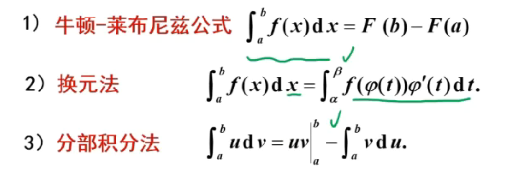

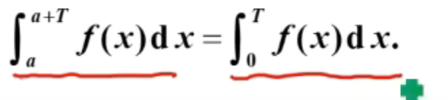

### 常见的定积分

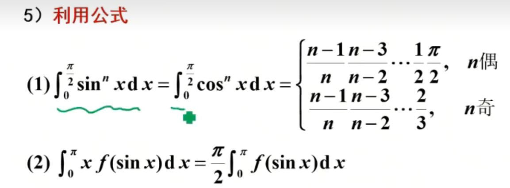

-   火箭
-   区间在现
-   

-   几 何意义

#  反常积分

-   无穷区间
-   有限区间 + 无界函数

##  无穷区间上的反常积分

如果极限存在，则反常积分是收敛的

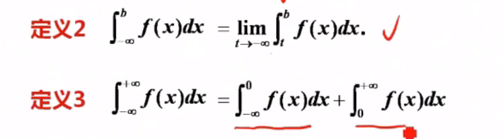

-   定义三要都收敛才收敛

## 判定方法

### 比较判别法

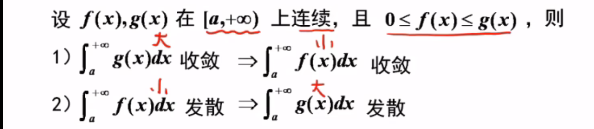

## 比较判别法的极限形式

 

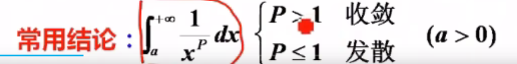

 

## 无界函数的敛散性

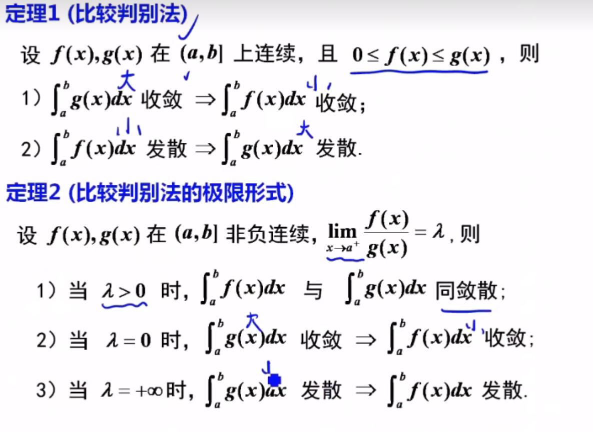

-----

小的发散则大的发散

大的收敛 则小的收敛

-----

https://www.bilibili.com/video/BV1waw7zGEPc?t=162.8&p=15十三上  

十二补

# 应用

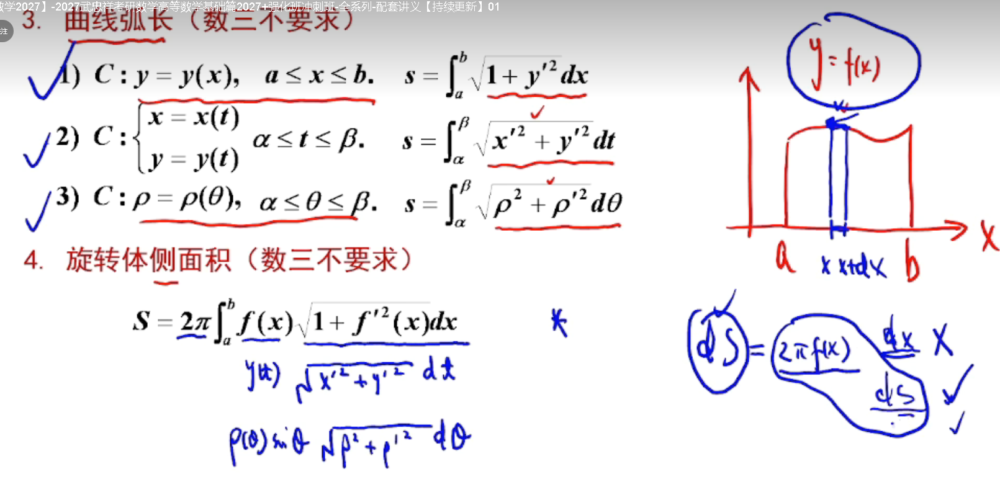