## 数列的极限

-   有界性
-   保号性

-   数列的极限与前有限项无关

 

~~~
反例（-1）^n 
~~~

# 函数的极限

-   定义

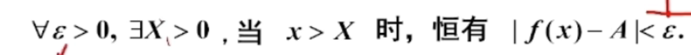

## 自变量趋向于有限值

  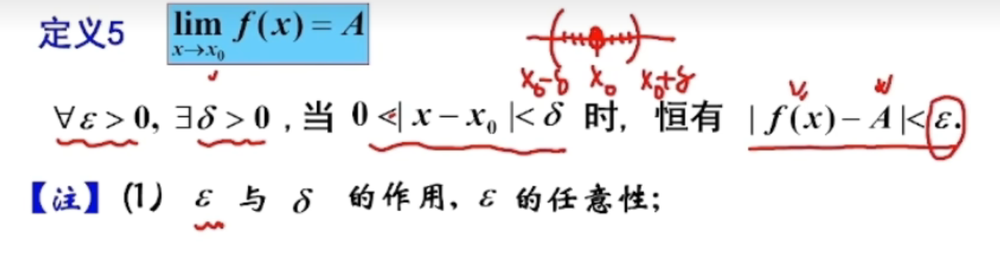

-   ==函数在x0无定义，也可以有极限==，==但是在去心邻域内必须有定义==

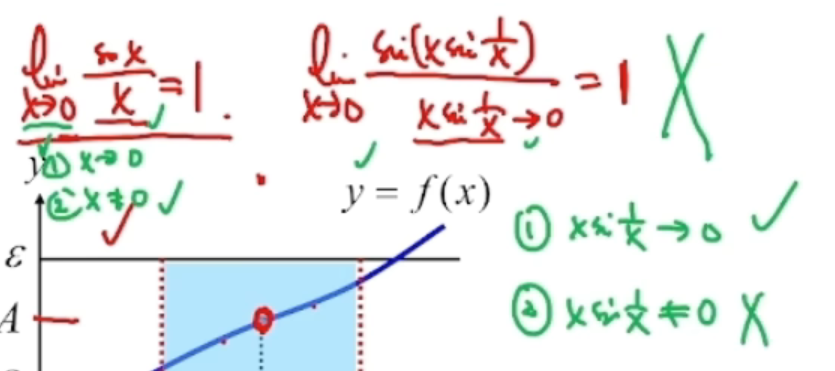

-   x趋向于0
-   x不等于0

但是

-   xsin1/x 曲线与0
-   不能保证不等于0

## 左极限和右极限

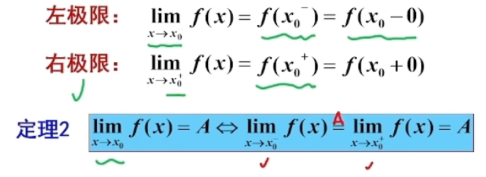

左右极限相等，才能得极限存在

## 左右极限的问题

-   分段函数在分界点的极限
-   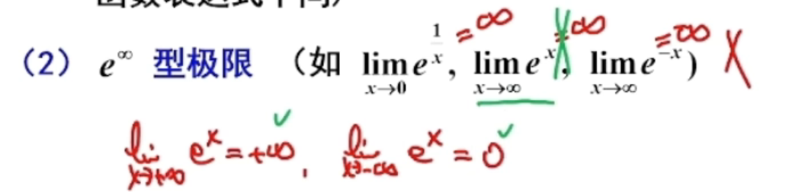
    -   左右无穷处的需要相等极限才存在
-   acrtan无穷
    -   

## 性质

-   有界性
    -   如果收敛则有界（收敛可以推出有界，有界不能推出收敛（可能在震荡））

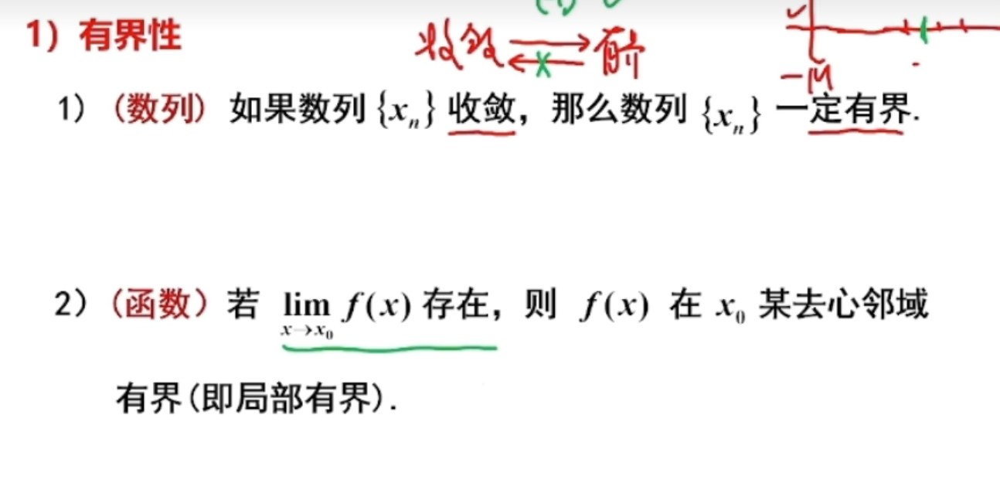

-   保号性
    -   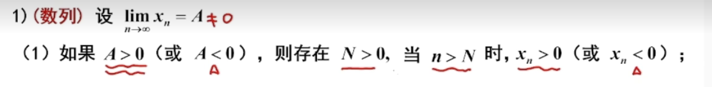

 ，   

## 无穷小量

-   极限为0的变量叫做**无穷小量**

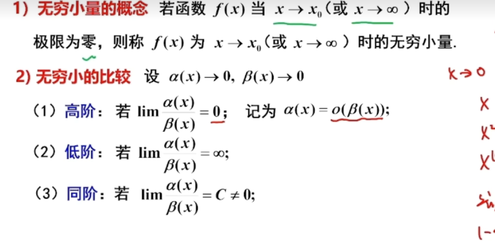

## 无穷小的性质

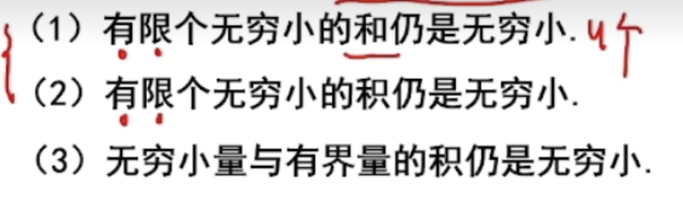

## 无穷大量

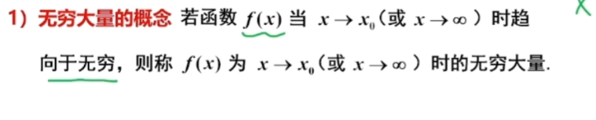

## 关系

# 求极限（八种）

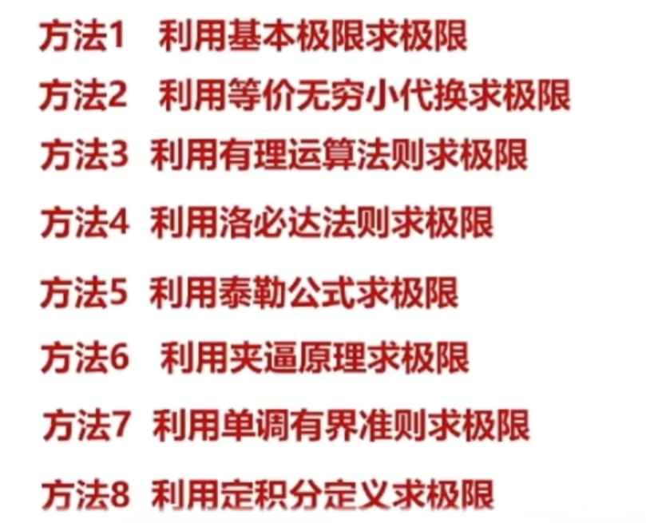

## 1.基本极限求极限

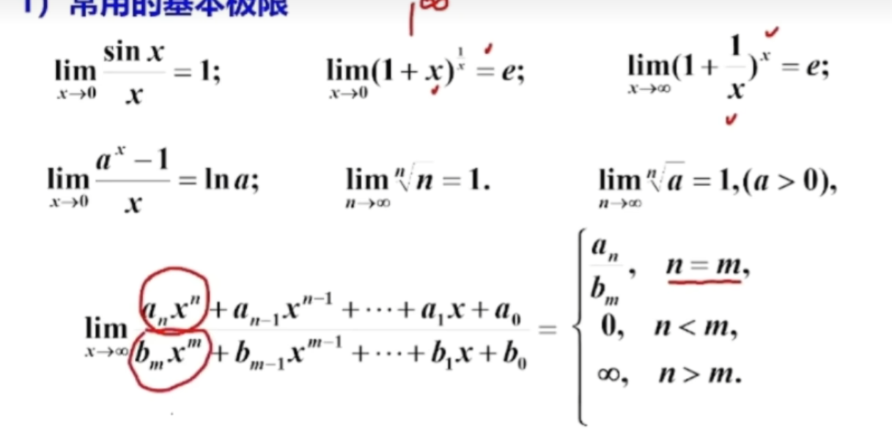

证明

### 例

~~~
（n/n+1）^p 和 （n/n+1）^n 不一样
~~~

