# 二次型

二次齐次多项式

===$f = x^TAx$

-   主对角线的元素是aii平方项的系数
-   xixj是一半系数

## 题型

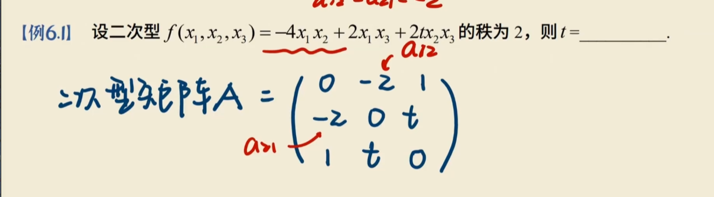

|A| = 0 = -4t

## 可逆线性变换

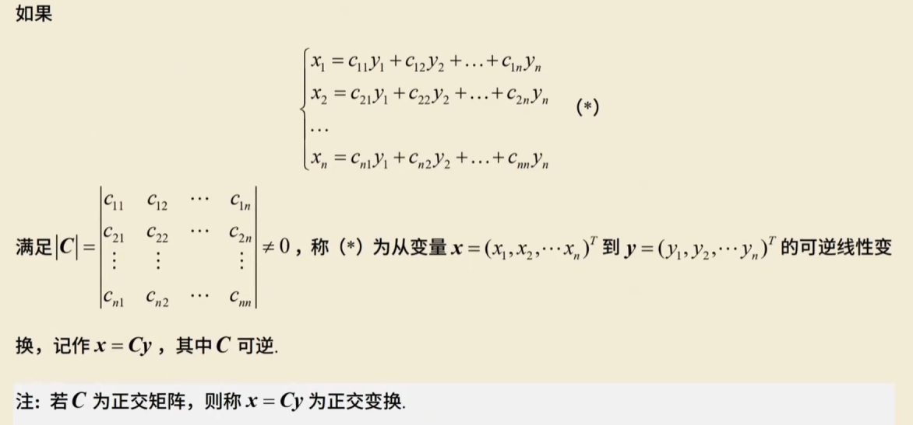

**换元**

~~~
把
f(x1,x2,x3)换成y1,y2,y3

根据矩阵提出来
x = Cy

~~~

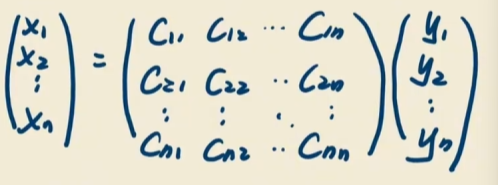

**C可逆**

若C为正交矩阵，则称是正交变换

### 题型

求Q

1.   写出二次型矩阵A
2.   求A特征值，正交阵
3.   另x = Qy将二次型化成标准型

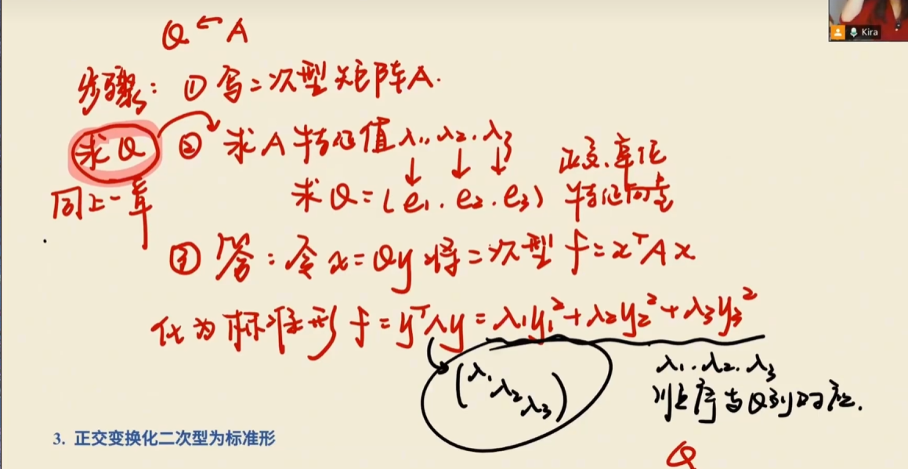

1.   A

~~~
0 -1 1
-1 0 1 = A
1 1 0 
~~~

2.   特征值

然后用施密特正交法求出正交向量

组合起来就是Q

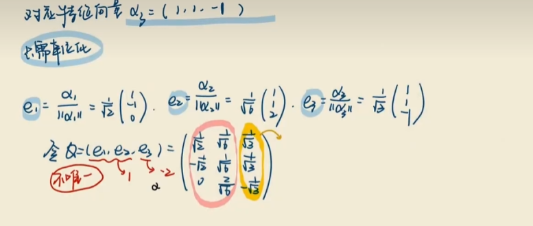

3.   用特征值组合起来

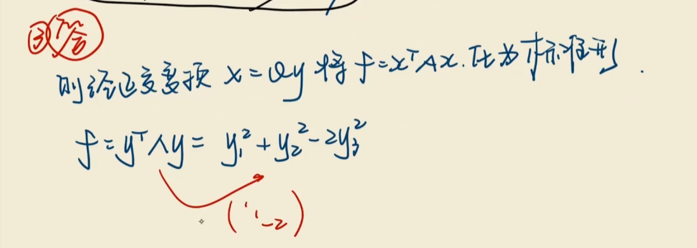

## 配方法

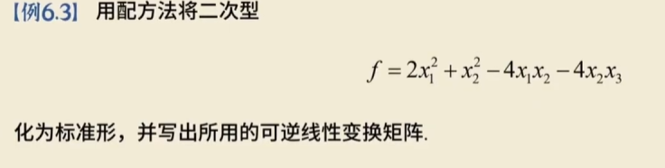

-   把含有x1的配方
-   把x2配方
-   换元

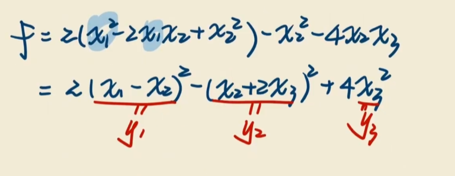

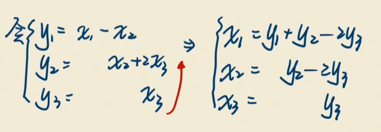

-   抄系数

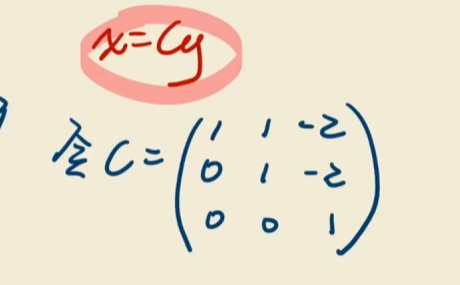

-   答

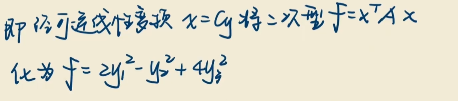