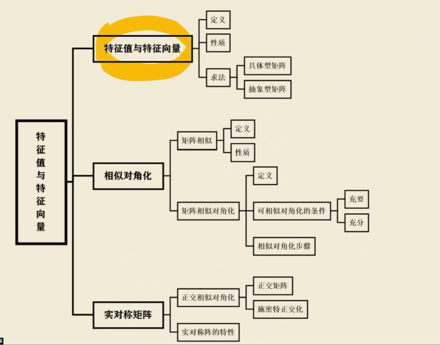
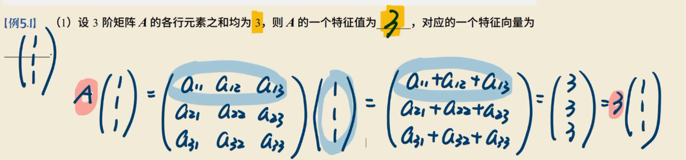

# 特征值 和特征向量

# 特征值和特征向量

-   n阶矩阵
-   方阵

存在数入和n维非零列向量x使**`Ax = 入x`**

即(`入E - A`)x = 0有非零解，则称入使一个特征值，非零解x使A对应入的特征向量

方向不变，大小伸缩

-   利用定义

 

## 求特征值

n阶矩阵在复数范围内有n个特征值

-   令|入E - A| = 0，求得特征值
-   带入每一个入
-   行最简
-   求基础解系 
-   通解
-   去掉零解
    -   并且系数不全为0

**例**

~~~
A = 1 4 6
	0 2 5
	0 0 3
	
入E - A = 入-1  -4     -6
		   0   	入-2   -5
		   0  	0     入-3
		   
 = (入-1)(入-2)(入-3) = 0
~~~

## 性质

1.   对于上（下）三角是主对角线的元素
2.   

