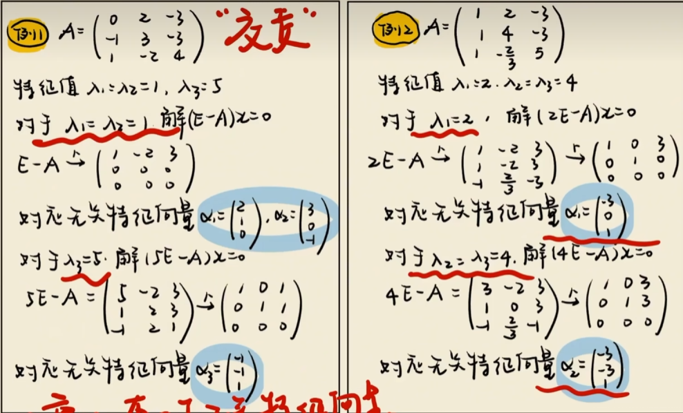
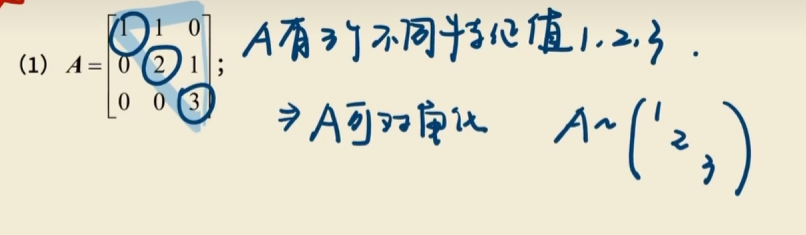
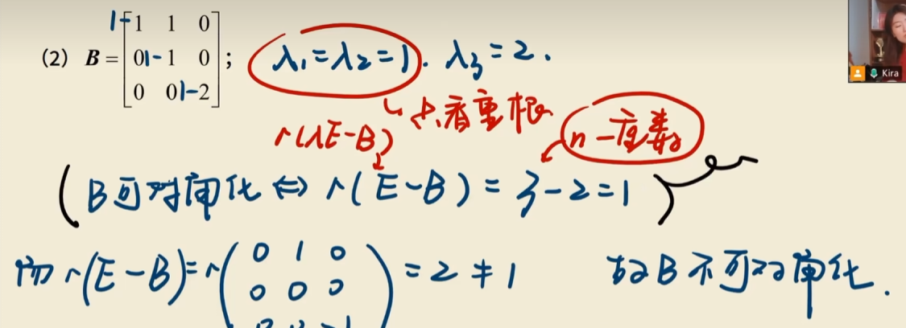

# 可逆

### 矩阵相似的定义

设 $A, B$ 是两个 $n$ 阶矩阵，若存在可逆矩阵 $P$，满足

$$P^{-1}AP = B,$$

则矩阵 $A$ 与 $B$ **相似**，记作 $A \sim B$

-   方阵(p夹出来的)
-   

## 性质

-   $P^{-1}AP = B => P^{-1}A^nP = B^n$
-   $B^{-1} = (P^{-1}A{-1}P)^{-1} = P^{-1}A{-1}P$
-   $B* = (P^{-1}AP)^{*} $

-   转置不能和其他的混在一起（A + AT）但是自身可以
-   AT ~ BT

-   |A| = |B|

-   特征值相同
-   R(A) = R(B)
-   tr(A) = tr(B)

# 相似对角化的充要条件

A只要能和对角阵相似就称可以对角化

### 矩阵的相似对角化

若矩阵 $A$ 与对角矩阵 $\Lambda$ 相似，即存在可逆矩阵 $P$，使 

$$P^{-1}AP = \Lambda,$$ 

则称 $A$ 可以**相似对角化**，记为 $A \sim \Lambda$，称 $\Lambda$ 是 $A$ 的**相似标准形**。

-   $\Lambda$主对角线上的元素为A的全部特征值
-   P的各列向量为A的n个线性无关的特征向量

## 性质

-   如果k重特征向量有k个线性无关的特征向量则可以相似对角化

-   左边都是都有，所以可以对角化
-   右边的二重少一个，所以不可以

 	1. A 恰有个线性无关的特征向量
 	2. 对于A的每个k重特征值λ₁，都有K个无关特征向量；
     每一个特征值都要拉满
     只需要看重根就可以了
 	3. 对于A的每个k重特征值入i,r(入iE - A) = n - ki

## 题型

-   三个特征值互相不同

不可以对角化

可以对角化

