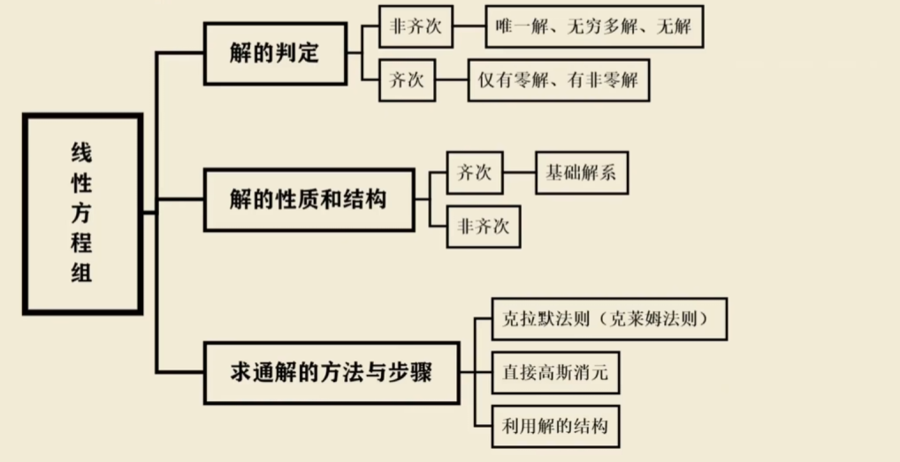
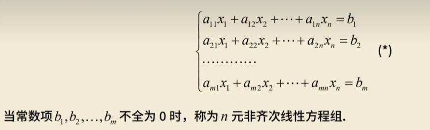
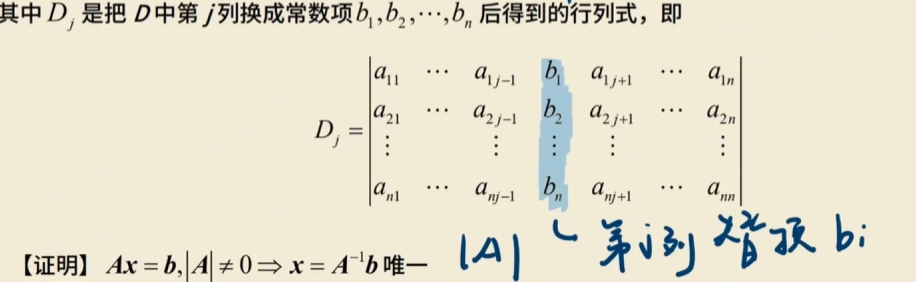
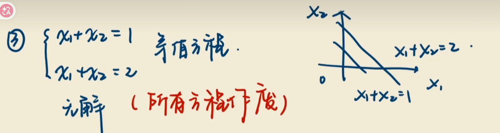
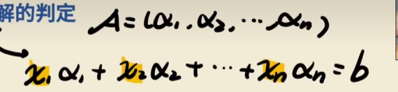

# 四.线性方程组

**齐次线性方程组：右边全为0**

**非齐次线性方程组：不为0**

## 克拉默法则

n个方程的n元方程组（方阵）

系数行列式不等于0

**若A的行列式不等于0则方程组必有唯一解**

~~~
|A| ≠ 0 <=> AX = b 有唯一解
~~~

$x_j = \frac{D_j}{D}  j = 1,2,3,4...n$

# 线性方程组的判定

## 非齐次方程组解的情况

-   唯一解

n个有效方程 n个未知数

<=> 

**满秩**

变成增广矩阵 R（A） = R(A,b)  = 有效行数 = 未知量的个数 = n

<=>

**b可以由A唯一表示**

b可由A的列向量线性表示，且表示法唯一

<=>

**只要行列式不为0，就是唯一解**

A为n阶方阵时，|A| ≠ 0，可用克拉默法则解 Ax = b

=>

**左边的向量组无关**

A = (a1,a2,...an)列向量线性无关

=>

Ax = 0只有零解

---

-   无穷多

R(A) = R(A,b) = 1 = 一个有效行数（方程） < 未知量个数 
没有矛盾方程

<=> 

**不满秩序**

R(A) = R(A,b) < n

<=> 

**b可以被多种表示**

b可以由A由无穷多种方式表示

=>

**克拉默法则，|A| = 0没有唯一解**

A为n阶方阵时，|A| = 0

~~~
(A,b) = (1 1 | 1)
		(0 0 | 0)
~~~

=>

**线性相关，有效方程组个数减少，**

A 向量组线性相关

=>

Ax = b有非零解

---

-   无解

R(A) > R(A,b)无解

<=> 

b不能由A的列向量组线性表示

​	找不到一组系数满足

=> 

**克拉默|A| = 0**

当A为n阶方程时，|A| = 0

~~~
(A,b) = (1 1 |1)
		(0 0 |1)
		
~~~

## 齐次线性方程组的解

必有零解，比过零点

不会有无解的情况

---

-   唯一解 

**唯一解就是零解**

---

-   无穷多解

**有效方程个数 < 未知量个数** ==>>**没有把变量全部约束，**

---

不可逆 = 不满秩 = 行列式等于0 = 线性相关 = 齐次线性方程组有非零解

